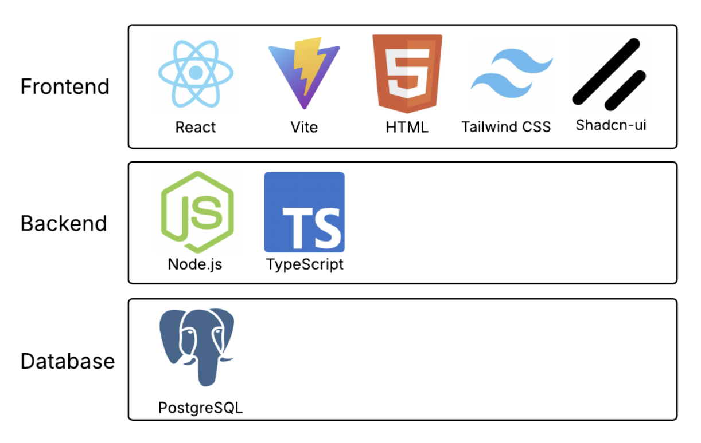
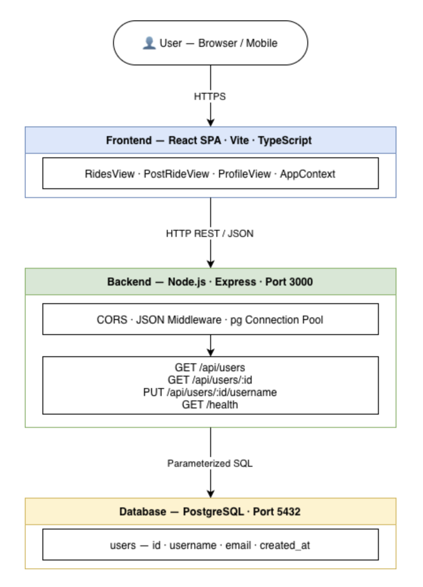

**App Summary**
Many college students have limited access to transportation but still rely on cars for groceries and other errands. Stüber facilitates voluntary ridesharing between students and local residents who have vehicles and those who do not. If a car owner plans to go to the grocery store and is willing to offer seats, they can post a ride on Stüber for others to view and request to join. For security and trust, users have profiles which others may rate depending on experience. Primary users include both riders seeking transportation and drivers offering available seats.

**Tech Stack**

**Architecture Diagram**

**PREREQUISITES**
Before running this project, ensure you have the following software installed on your machine:
Node.js (v18 or higher) Official Site: https://nodejs.org/
PostgreSQL (Database Server) Official Site: https://www.postgresql.org/download/
psql (Command Line Tools) Note: This is usually included with your PostgreSQL installation. Ensure it is added to your system PATH so it can be run from any terminal.
Verification Commands: To check if these are installed correctly, run the following in your terminal:
Check Node: node -v
Check psql: psql --version

**INSTALLATION AND SETUP**
Step 1: Install Dependencies Navigate to the project root and install packages for both the frontend and backend:
For the backend: cd backend npm install
For the frontend: cd ../frontend npm install
Step 2: Database Configuration Ensure your PostgreSQL server is active. Run these three commands in order to create and populate your database:
Create Database: psql -U postgres -c "CREATE DATABASE stuber;"
Run Schema: psql -U postgres -d stuber -f db/schema.sql
Run Seed Data: psql -U postgres -d stuber -f db/seed.sql
Step 3: Environment Variables
Navigate to the /backend folder.
Create a file named .env (you can copy .env.example as a template).
Open .env and verify your credentials (DB_USER, DB_PASSWORD, etc.) match your local PostgreSQL settings.

**RUNNING THE APPLICATION**
You will need two separate terminal windows or tabs running at the same time.
Terminal 1 (Backend):
cd backend
npm run dev The server will start at: http://localhost:3000
Terminal 2 (Frontend):
cd frontend
npm run dev The frontend will start at the URL shown in your terminal (usually http://localhost:5173). Open this URL in your browser to view the app.

**VERIFYING THE VERTICAL SLICE**
Follow these steps to confirm the full stack is working correctly:
Trigger the Change: Navigate to the "User Profile" section in the application.
Edit Data: Select the pencil icon next to the username and edit the name to something new. Save the changes.
Confirm Persistence: Refresh the page or restart both the frontend and backend servers.
Verify: Return to the profile page. If the edited username is still displayed, the change has successfully persisted in the PostgreSQL database.

